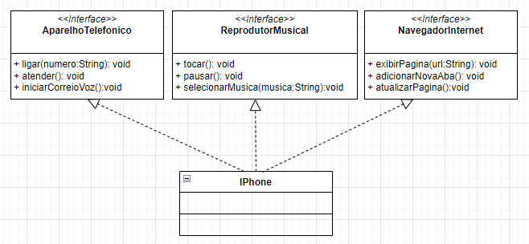

## Desafio DIO - Modelando o iPhone com UML (Funções Basicas).

Esse foi o desafio proposto no módulo de Programação Orientado a Objetos (Fundamentos/Pilares do paradigma).
Criar um diagrama UML que representasse as funções de um aparelho telefônico, reprodutor musical e navegador de internet,
simulando o lançamento do IPhone em 2007.

## Segue abaixo a imagem do diagrama.

## Observação.

Para solidificar o conhecimento, optei por implementar o diagrama e deixar o código disponível para análise e estudo aqui nesse repositório.

